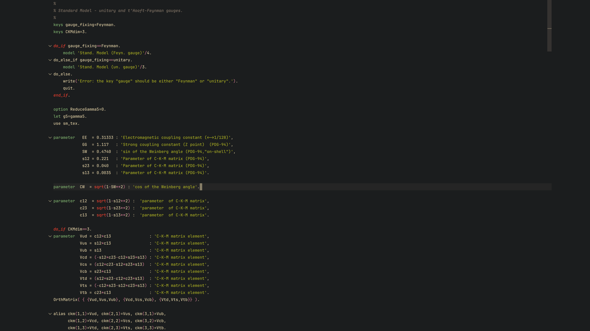

# lanHEP VSCode Utils README

I have started learning about [microOMEGAs](https://lapth.cnrs.fr/micromegas/), which led me to [lanHEP](https://theory.sinp.msu.ru/~semenov/lanhep.html). Although beautiful, it seems to have no support for VSCode yet. Therefore, I am creating lanHEP language support for VSCode.

This extension provides syntax highlighting, indentation rules, and keyword support for the lanHEP language. It is designed for efficient editing and development of lanHEP models, with proper classification of keywords, operators, constants, and functions.

Created using [Yeoman](https://yeoman.io/).

## Features

Implemented so far:

- [x] lanHEP syntax highlighting.
- [x] Auto-completion support for brackets and strings (e.g., `{}`, `()`).
- [x] Support for comment shortcuts (`%`).

Planned Features:

- [ ] Intellisense for lanHEP, including keyword suggestions and error detection.
- [ ] Improvements to grammar for VSCode, such as better recognition of lanHEP constructs.

## Preview

Here’s an example of lanHEP syntax highlighting using this extension:

## Installation

This extension is available on the [VSCode Marketplace](https://marketplace.visualstudio.com/items?itemName=thefermi0n.lanhep-vscode-utils).

Alternatively, you can manually install it using the `.vsix` file from the release page.

### Steps for Marketplace Installation

1. Open VSCode.
2. Go to the Extensions Marketplace (`Cmd+Shift+X` or `Ctrl+Shift+X`).
3. Search for `lanHEP VSCode Utils`.
4. Click "Install".

### Steps for Manual Installation

1. Go to the [Releases](https://github.com/thefermi0n/lanHEP-VSCode-Utils/releases/latest) page of this repository.
2. Download the latest `.vsix` file.
3. Open VSCode.
4. Open the Command Palette (`Cmd+Shift+P` or `Ctrl+Shift+P`) and type `Extensions: Install from VSIX...`.
5. Select the downloaded `.vsix` file.
6. Wait for the installation to complete.

## Known Issues

- Some keywords may be missing or not highlighted correctly. These will be addressed in the next release.
- Auto-completion is currently limited to brackets and strings.

## Release Notes

For a list of updates and fixes, see [CHANGELOG.md](./CHANGELOG.md).

## Bug Reports

If you encounter any issues, please create an issue in the repository. I will respond as soon as possible.
